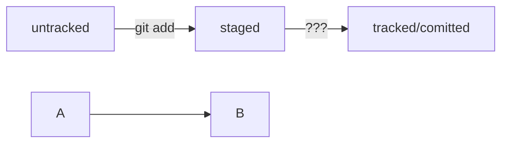

# Шпаргалка Markdown

## Выделение текста

Вы можете выделять текст в Markdown с помощью символов '_' или '*'

Пример _Курсива_ и **Жирного** текста.

## Заголовки

Заголовки можно создать с помощью символа '#'. Чем больше '#', Тем меньше заголовок. Например:

# Заголовок первого уровня
## Заголовок второго уровня
### Заголовок третьего уровня

## Выделение кода 

Чтобы выделить текст ка код, поместите его в тройные кавычки ''''''.

'''
Mkdir my_project
Cd my_project
Git init
'''

Это лишь некоторые функции markdown


# Шпаргалка **Kommit**

## ХЕШ - индетификатор коммита
Хеширование - способ преобразовать набор данных и получить их "отпечаток" 
Git хеширует (преобразует) информацию о коммите с помощью алгоритма **SHA-1** (от англ. Secure Hash Algorithm — «безопасный алгоритм хеширования») и получает для каждого коммита свой уникальный хеш — результат хеширования.
    Обычно хеш — это короткая (40 символов в случае SHA-1) строка, которая состоии из цифр 0—9 латинских букв A-F (неважно, заглавных или строчных). Она обладает следующими важными свойствами:
_если хеш получить дважды для одного и того же набора входных данных, то результат будет гарантированно одинаковый;_
_если хоть что-то в исходных данных поменяется (хотя бы один символ), то хеш тоже изменится (причём сильно)._


## Расбираемся с **ЛОГ**

*Log* -  журнал записей (с англ)
строка из цифр и латинских букв после слова _commit_ - это шег коммита
_Autor_ - имя автора и электронная почты
_Date_ дата и время
в конце находится сообщение коммита

#### commit e83c5163316f89bfbde7d9ab23ca2e25604af290
Author: Linus Torvalds <torvalds@linux-foundation.org>
Date:   Thu Apr 7 15:13:13 2005 -0700

    Initial revision of "git", the information manager from hell
**Получить сокращённый лог — git log --oneline
Получить сокращённый лог можно с помощью команды git log с флагом --oneline (англ. «одной строкой»). В терминале появятся только первые несколько символов хеша каждого коммита и их комментарии.
### * Если выход не произошел автоматически - необходимо нажать Q (quit)* 

## HEAD -  всему голова

ФАЙЛ - HEAD - один из служебных файлов папки .git. Он указывает на коммит, который сделан последним (то есть на самый новый).

$ pwd # посмотрели, где мы
/Users/user/dev/first-project

$ cd .git/
$ ls # посмотрели, какие есть файлы
COMMIT_EDITMSG  ORIG_HEAD  description  index  logs/     refs/
HEAD            config     hooks/       info/  objects/

$ cat HEAD # команда cat показывает содержимое файла
ref: refs/heads/master # в файле вот такая ссылка 


Файл HEAD (англ. «голова», «головной») — один из служебных файлов папки .git. Он указывает на коммит, который сделан последним (то есть на самый новый).

В этом можно убедиться с помощью терминала. Перейдите в папку .git командой cd. Посмотрите содержимое файла HEAD командой cat.

$ pwd **# посмотрели, где мы**
/Users/user/dev/first-project

$ cd .git/
$ ls # посмотрели, какие есть файлы
COMMIT_EDITMSG  ORIG_HEAD  description  index  logs/     refs/
HEAD            config     hooks/       info/  objects/

$ cat HEAD # команда cat показывает содержимое файла
ref: refs/heads/master # в файле вот такая ссылка 


HEAD -- это голова.
Коммит -- это всему голова.
Статусы файлов:
<тут пустая строка!>

```mermaid
%% описание схемы
```
<и тут пустая строка!>



